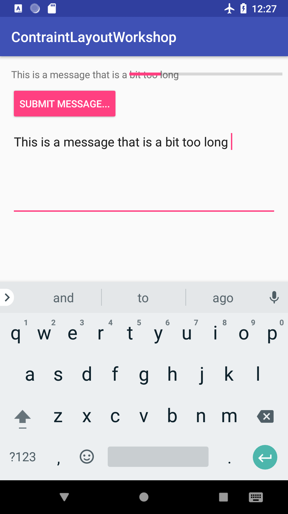

# Barriers - ConstraintLayout Workshop ([back to master](https://github.com/ErikHellman/ConstraintLayoutWorkshop/tree/refactoring))

In this task you shall use barriers to constraint the start position of the progress bar to two views (The `TextView` and the `Button`).

You can find a good introduction to barriers at [ConstraintLayout.com](https://constraintlayout.com/basics/barriers.html) (thanks to Mark Allison and friends for this excellent site!). 

