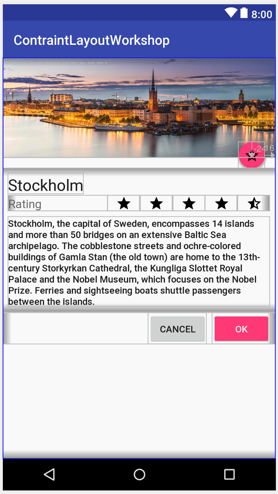

# Refactoring layouts - ConstraintLayout Workshop ([back to master](https://github.com/ErikHellman/ConstraintLayoutWorkshop/tree/master))

Your task in this part is to refactor the [`activity_main.xml`](https://github.com/ErikHellman/ConstraintLayoutWorkshop/blob/refactoring/app/src/main/res/layout/activity_main.xml) so that it uses a single `ConstraintLayout` as a root and has no nested elements at all. This task also includes a few bugs, such as the size of the header image being fixed regardless of screen size. This should also be fixed.

   