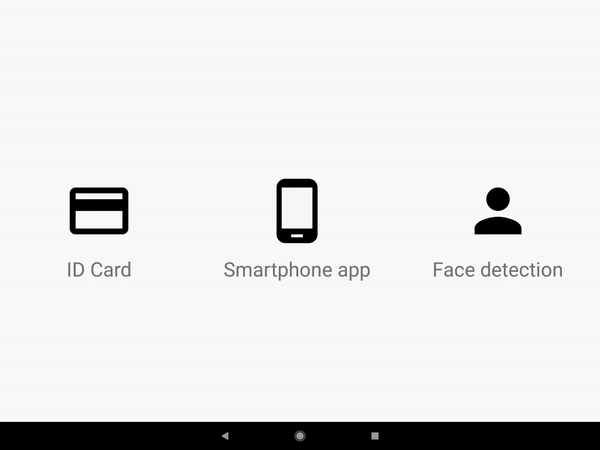

# ConstraintLayout Workshop

This repository is the base for a workshop where you will learn how to use ConstraintLayout efficiently in Android development. 

The workshop is constructed of a number of tasks which each focus on a specific part. The tasks are sorted under different branches in this repository. 

- [Refactoring from RelativeLayout and LinearLayout](tree/refactoring) 

Refactor the `activity_main.xml` so that it uses only a single `ConstraintLayout`.

- [Movie Rental screen](tree/movie_rental)

The task is to create two XML layouts using ConstraintLayout, and animate between them as shown in the picture below. All the image resources are found in the project. 

- [Animations with Guidelines](tree/animnations_with_guidelines)

The task is to replicate the animation in the picture below.

- [Barriers](tree/barriers)

